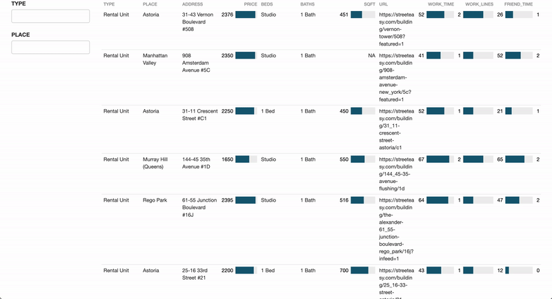

## StreetEasy webscraper and apartment finder

### Summary & Purpose
StreetEasy listings do not contain all of the information that a potential renter is interested in knowing when apartment hunting. For me, I check how long it takes to get to work and a friend's house, see how many parks are nearby, and try to figure out if the area is safe. So I decided to gather the information automatically! This github was created to do the following:

- Web scrape StreetEasy NYC rental data for select neighborhoods and incorporate metrics on:
  - travel time from apartment to points of interest (e.g. work and a friend's house), 
  - park access, 
  - neighborhood safety
- Combine information into an interactive table. 




***  

### Data Sources 
- [StreetEasy](https://streeteasy.com/for-rent/nyc)
- [Geoapify](https://apidocs.geoapify.com/)
- [NYC Council Data Team Park Equity Analysis](https://github.com/NewYorkCityCouncil/park_equity_covid_2022)
- [NYPD Arrest Data (Year to Date)](https://data.cityofnewyork.us/Public-Safety/NYPD-Arrest-Data-Year-to-Date-/uip8-fykc)

### Data Dictionary

| Variable | Description |
|----------------------------------------------------------------|--------------------------------------------------------------------------|
| Type | Rental type | 
| Place | Neighborhood |
| Address | Rental address | 
| Price | Monthly price listed on StreetEasy |
| Beds | Number of Beds | 
| Baths | Number of Baths |
| SQFT | Rental square footage | 
| URL | StreetEasy listing URL |
| Work_Time | Travel time from rental to work address (customizable)| 
| Work_Lines | Number of subway lines needed to reach work address (e.g. 2 indicates must transfer subways) |
| Friend_Time | Travel time from rental to friend address (customizable)| 
| Friend_Lines | Number of subway lines needed to reach friend address (e.g. 2 indicates must transfer subways) |
| Park_Acres | Accesible park acres per 1,000 residents within a 15 minute walk | 
| Borough | Borough of rental |
| Arrests | Arrests per 1,000 residents in the census tract of the rental | 


### Run instructions

To update the output and table:

```
bash scripts/bash.sh
```

### Scripts

#### 01_streeteasy.py
Webscraper for StreetEasy rental data. Can be customized for different neighborhoods and amenitites by editing the URL in the code. Output is data/streeteasy.csv. 

#### 02_travel.py
Retrieves routing information using Geoapify to determine travel time, directions, and number of subway lines from each apartment to a preset list of destinations. Code can be customized to add as many destinations as desired and mode of transportation (default is subway). Input is data/streeteasy.csv and output is data/apt_csv.csv. 

#### 03_metrics.py
Retrieves park access data from NYC Council Data Team Park Equity github to determine amount of acres of park accessible within a 15-minute walk of the apartment's census tract. Also deteremines the number of NYPD arrests that have occurred in the apartment's census tract for the current year. Input is data/apt_csv.csv and output is data/apt_metrics.csv. 

#### 04_table.R
Creates an interactive HTML table. Two filters for rental type (apartment, condo, etc.) and neighborhood are included. Input is apt_metrics.csv and output is visuals/filter_table.html. 

#### bash.sh
Runs the 01-04 scripts sequentially to produce/update the output and table. 

### Author

[Nick Montalbano](https://github.com/NicholasMontalbano)

### Requirements

- Geoapify API Key
- Grab cookies using developer tools while on StreetEasy webpage
- requirements.txt
- Libraries listed on top of 04_table.R

### Version History

* 0.1
    * Initial Release
    * Working as of July 3, 2022
    
### Acknowledgments

Inspiration and Code Snippets
* [Zillow WebScrapingWithAndy](https://www.youtube.com/watch?v=dRcvJRmqFHQ&t=3s&ab_channel=WebScrapingwithAndy)
* [NYCC Data Team Github](https://github.com/NewYorkCityCouncil)
* [How to Make Beautiful Tables in R](https://rfortherestofus.com/2019/11/how-to-make-beautiful-tables-in-r/)
